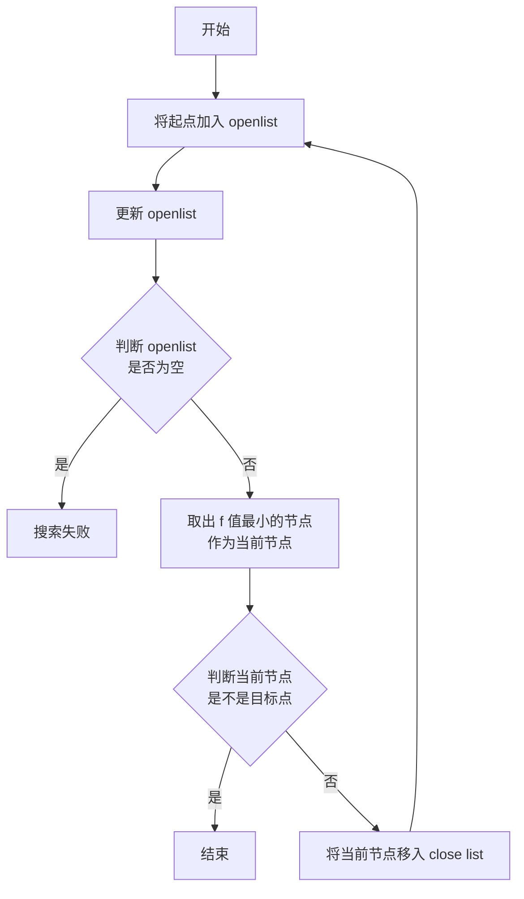

```mermaid
```mermaid
flowchart TD
    A[开始] --> B[将起点加入 openlist]
    B --> C[更新 openlist]
    C --> D{判断 openlist<br>是否为空}
    D -->|是| E[搜索失败]
    D -->|否| F[取出 f 值最小的节点<br>作为当前节点]
    F --> G{判断当前节点<br>是不是目标点}
    G -->|是| H[结束]
    G -->|否| I[将当前节点移入 close list]
    I --> B
  
```